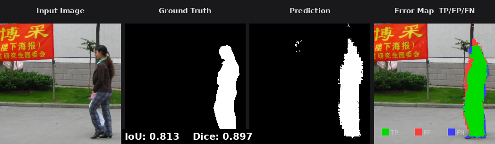
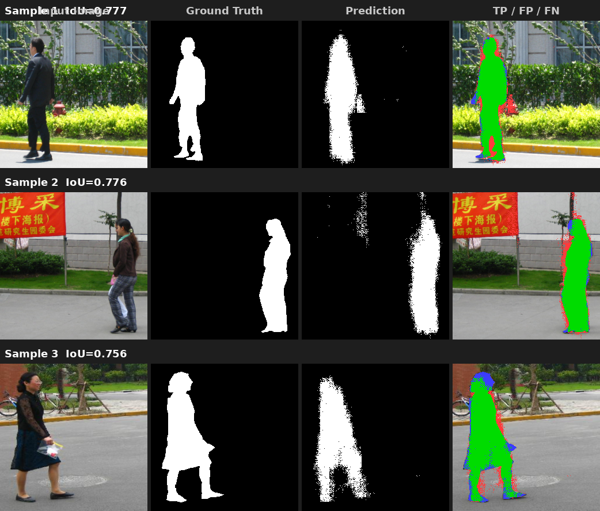

# Swin-UNet — Satellite Imagery Segmentation with Transformers

[](https://pypi.org/project/keras-swin-unet/)
[](https://pypi.org/project/keras-swin-unet/)
[](https://www.tensorflow.org/)
[](LICENSE)
[](https://pypi.org/project/keras-swin-unet/)

**Revolutionize geospatial analysis with Swin-UNet** — a cutting-edge solution for satellite imagery segmentation using Swin Transformers and UNet. Achieve state-of-the-art precision in road extraction, land cover classification, and infrastructure mapping. Ideal for GIS professionals, urban planners, and AI researchers. Train, test, and infer with just three lines of code.

```python
from keras_swin_unet import swin_train, swin_infer

swin_train(data="./dataset", epochs=50)           # train
swin_infer(image="input.jpg", output="out.png")   # predict
```

Swin-UNet combines the **Swin Transformer** (hierarchical shifted-window self-attention) with the **U-Net** encoder-decoder design. It captures global context that CNNs miss while remaining computationally efficient. This package wraps the full architecture into a production-ready Keras pipeline — training, validation, inference, and visualization in a single call.

## Installation

```bash
pip install keras-swin-unet
```

Requires Python 3.10+ and TensorFlow 2.19+.

## Quick Start

### 1. Prepare Your Data

```
dataset/
  images/    # RGB images (.png, .jpg, .tif, .npy)
  masks/     # Pixel-level labels (same filenames, any image format)
```

For binary segmentation, masks should have pixel values `0` (background) and `255` (foreground). For multi-class, use values `0, 1, 2, ...` and set `num_classes` accordingly.

### 2. Train

```python
from keras_swin_unet import swin_train

swin_train(
    data="./dataset",
    model_dir="./checkpoint",
    num_classes=2,
    epochs=50,
    bs=8,
    loss_type="focal_dice",
    input_shape=[256, 256, 3],
)
```

That's it. The training loop handles data splitting (80/10/10), normalization, augmentation-ready loading, focal loss with class balancing, early stopping, model checkpointing, and saves evaluation metrics as JSON.

### 3. Predict

```python
from keras_swin_unet import swin_infer

# Batch inference on a test set
swin_infer(data="./dataset", model_dir="./checkpoint")

# Single image
swin_infer(image="photo.jpg", output="segmentation.png", model_dir="./checkpoint")
```

### CLI (Alternative)

```bash
swin-unet train --data ./dataset --epochs 50 --loss-type focal_dice
swin-unet infer --image photo.jpg --output result.png --model-dir ./checkpoint
```

## Loss Functions

Choose the loss that fits your data. Change it with `loss_type="..."`.

| `loss_type` | Behavior | Best For |
|-------------|----------|----------|
| `focal` | Down-weights easy examples | Heavy class imbalance |
| `dice` | Optimizes region overlap directly | IoU-critical tasks |
| `bce` | Standard binary cross-entropy | Balanced classes |
| `bce_dice` | Pixel loss + region loss | General purpose |
| `focal_dice` | Focal + Dice combined | Imbalanced + precision boundary |
| `focal_tversky` | Focal applied to Tversky | Asymmetric FP/FN costs |
| `tversky` | Weighted Dice variant | Tunable precision/recall trade-off |

All losses are proper Keras `Loss` subclasses — models save and load with `model.save()` / `load_model()` without custom objects for the loss.

## API

### `swin_train(**kwargs)`

Only `data` is required. Everything else has sensible defaults.

| Parameter | Default | Description |
|-----------|---------|-------------|
| `data` | `"./demo_data"` | Dataset directory with `images/` and `masks/` |
| `model_dir` | `"./checkpoint"` | Where to save model and metrics |
| `num_classes` | `2` | Number of output classes |
| `epochs` | `5` | Training epochs |
| `bs` | `4` | Batch size |
| `patience` | `3` | EarlyStopping patience |
| `filter` | `128` | Embedding dimension (model capacity) |
| `depth` | `4` | Encoder/decoder stages |
| `stack_down` | `2` | Swin blocks per encoder stage |
| `stack_up` | `2` | Swin blocks per decoder stage |
| `patch_size` | `[4, 4]` | Initial patch size |
| `num_heads` | `[4, 8, 8, 8]` | Attention heads per stage |
| `window_size` | `[4, 2, 2, 2]` | Attention window per stage |
| `num_mlp` | `512` | MLP hidden size in Swin blocks |
| `loss_type` | `"focal"` | Loss function (see table above) |
| `gamma` | `2.0` | Gamma for focal-based losses |
| `alpha` | `0.25` | Alpha for focal-based losses |
| `input_shape` | `[512, 512, 3]` | Input image shape [H, W, C] |
| `input_scale` | `255` | Divide input images by this |
| `mask_scale` | `255` | Divide mask images by this |
| `visualize` | `2` | How many test images to visualize |

### `swin_infer(**kwargs)`

| Parameter | Default | Description |
|-----------|---------|-------------|
| `model_dir` | `"./checkpoint"` | Path to trained model |
| `image` | `None` | Single image to segment (if `None`, runs on test set) |
| `output` | `"output.png"` | Where to save the overlay |
| `data` | `"./demo_data"` | Dataset for batch inference |
| `num_classes` | `2` | Must match training |
| `input_shape` | `[512, 512, 3]` | Must match training |
| `input_scale` | `255` | Must match training |
| `mask_scale` | `255` | Must match training |
| `visualize` | `1` | How many samples to visualize |

## Architecture

```
Input [H, W, 3]
  → Patch Embedding (4×4) → [H/4, W/4, C]
  → Encoder Stage 0: Swin Blocks → skip₀
  → Patch Merging → [H/8, W/8, 2C]
  → Encoder Stage 1: Swin Blocks → skip₁
  → Patch Merging → [H/16, W/16, 4C]
  → Encoder Stage 2: Swin Blocks → skip₂
  → Patch Merging → [H/32, W/32, 8C]
  → Encoder Stage 3: Swin Blocks → skip₃
  → Bottleneck: Swin Blocks
  → Patch Expanding → concat skip₂ → Decoder Stage 0
  → Patch Expanding → concat skip₁ → Decoder Stage 1
  → Patch Expanding → concat skip₀ → Decoder Stage 2
  → Patch Expanding (4×) → pixel resolution
  → Conv2D Softmax → Segmentation Map
```

Each Swin Transformer block alternates **regular** and **shifted-window** multi-head self-attention. Shifted windows allow cross-window communication without the quadratic cost of global attention.

## Advanced Usage

For full control, build the model directly:

```python
from swin_transformer.model_loader import get_model
from swin_transformer.AUC_LOSS import FocalDiceLoss

model = get_model(
    input_size=(512, 512, 3),
    filter_num_begin=96,
    depth=4,
    stack_num_down=2,
    stack_num_up=2,
    patch_size=[4, 4],
    num_heads=[3, 6, 12, 24],
    window_size=[7, 7, 7, 7],
    num_mlp=1024,
    num_classes=5,           # multi-class segmentation
)
model.compile(
    optimizer="adam",
    loss=FocalDiceLoss(alpha=0.25, gamma=2.0, focal_weight=0.5),
    metrics=["accuracy"],
)
model.fit(train_loader, validation_data=val_loader, epochs=100)
```

## Performance

### PennFudan Pedestrian Detection

Binary segmentation, 256×256, **170 images, trained from scratch** on CPU. No pre-training, no fine-tuning. 63 epochs, 11.4M params.

| Metric | Score |
|--------|-------|
| Accuracy | 85.3% |
| IoU (Jaccard) | 0.641 |
| Precision | 77.8% |
| Recall | 75.3% |
| F1 Score | 0.764 |

**Best prediction** from the test set (IoU 0.813, Dice 0.897):



*Left to right: input image, ground truth mask, model prediction, error map (green = true positive, red = false positive, blue = false negative).*

### Multi-Sample Comparison



*Three test samples with per-sample IoU/Dice scores. The model segments pedestrians accurately despite heavy class imbalance (~10% foreground pixels) and only 118 training images.*

## Applications

- **Remote Sensing & GIS** — road extraction, land cover classification, building detection
- **Medical Imaging** — organ segmentation, tumor delineation, cell counting
- **Autonomous Driving** — lane marking, pedestrian detection, drivable area
- **Agriculture** — crop field boundaries, vegetation indices
- **Industrial** — defect detection, part segmentation, quality control

## Citation

If you use this package in your research, please cite the original works:

```bibtex
@inproceedings{cao2022swinunet,
  title={Swin-Unet: Unet-like Pure Transformer for Medical Image Segmentation},
  author={Cao, Hu and Wang, Yueyue and Chen, Joy and Jiang, Dongsheng and
          Zhang, Xiaopeng and Tian, Qi and Wang, Manning},
  booktitle={ECCV Workshops},
  year={2022}
}

@inproceedings{liu2021swin,
  title={Swin Transformer: Hierarchical Vision Transformer using Shifted Windows},
  author={Liu, Ze and Lin, Yutong and Cao, Yue and Hu, Han and Wei, Yixuan and
          Zhang, Zheng and Lin, Stephen and Guo, Baining},
  booktitle={ICCV},
  year={2021}
}
```

## License

MIT.

---

**Maintainer**: Laeeq Aslam — [laeeq.aslam.100@gmail.com](mailto:laeeq.aslam.100@gmail.com)
