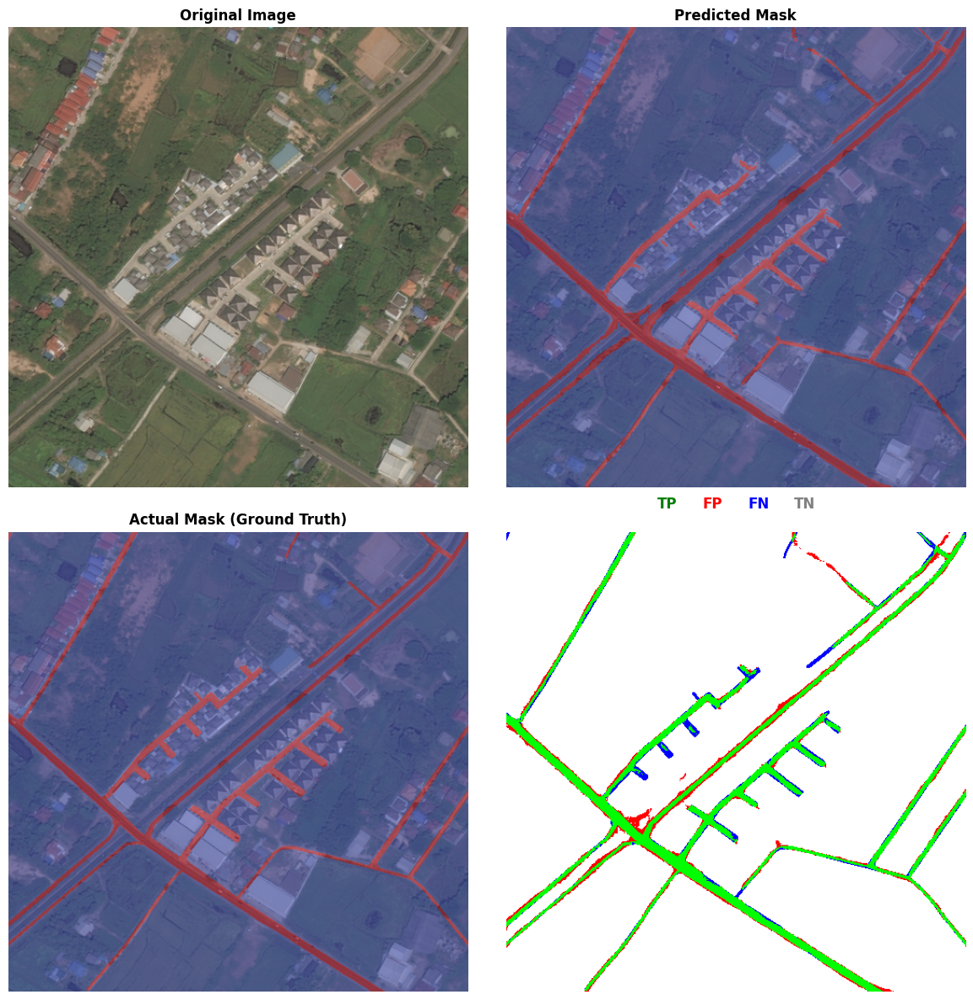
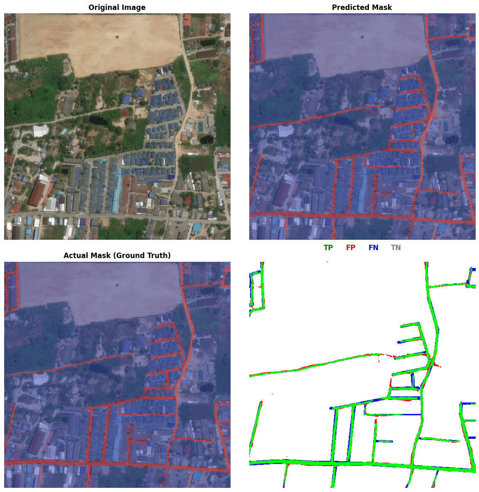

# Swin-UNet Road Extraction Model

## Overview  
## Overview  

This repository provides a **Swin-UNet** implementation for **road extraction** from satellite imagery, specifically designed to handle the challenges of segmentation in **remote sensing**. The model combines the power of **Swin Transformers** for feature extraction and **U-Net** for segmentation, making it particularly effective for **semantic segmentation tasks** like road extraction. The model has achieved **state-of-the-art performance** on the **DeepGlobe Road Extraction Dataset**.

### Key Features:
- **AUC Focal Loss**: We use **AUC Focal Loss**, a loss function that is particularly effective for imbalanced datasets. This loss function gives higher priority to the minority class (in this case, the road class), improving the model's ability to detect smaller or underrepresented classes, which is crucial for tasks like road segmentation in satellite imagery.
  
- **Swin Transformer**: The model integrates the **Swin Transformer** architecture, which provides excellent performance in handling large-scale spatial dependencies in images, making it ideal for high-resolution satellite imagery.

- **U-Net Architecture**: The **U-Net** component of the model helps achieve precise segmentation by leveraging an encoder-decoder structure with skip connections. This allows for fine-grained predictions, especially for complex segmentation tasks like road extraction.

- **Multiclass Segmentation**: Although it has been tested on binary road extraction (road vs. non-road), the model is capable of **multiclass segmentation**. By adjusting the number of output classes, the same architecture can be applied to more complex segmentation problems, such as identifying multiple classes (e.g., roads, buildings, water bodies) in satellite images.

- **TensorFlow Implementation**: This is a **TensorFlow 2.x** implementation, making it highly optimized for training with modern GPUs. It offers flexibility for both **single-class and multi-class segmentation** tasks. The model can be easily adapted to work with different datasets, and it supports customizable configurations such as the number of attention heads, patch sizes, and window sizes.

The **Swin-UNet** model is designed to be flexible, allowing researchers and practitioners to train on a variety of segmentation tasks, leveraging the capabilities of both **Swin Transformers** and **U-Net** in a unified framework.

Key metrics evaluated during training and testing include:
- **Accuracy**
- **F1 Score**
- **Precision**
- **Recall**
- **AUC (Area Under Curve)**

With this flexible architecture, you can easily apply it to other **remote sensing segmentation tasks** beyond road extraction, making it a versatile tool for semantic segmentation in **satellite imagery**, **urban planning**, and **geospatial analysis**.


---

## Dependencies  
- **Python 3.7+**  
- **TensorFlow 2.10.0+**  
- **Keras**  
- **Matplotlib**  
- **scikit-learn**  
- **Pillow (PIL)**  
- **NumPy**  

Install requirements:  
```bash
pip install -r requirements.txt
# Getting Started

## 1. Clone Repository

```bash
git clone https://github.com/your-repo/swin-unet-road-extraction.git
cd swin-unet-road-extraction
```
## 2. Prepare Dataset

Download and organize the DeepGlobe Road Extraction Dataset:

```plaintext
data/
├── images/     # Satellite images
└── masks/      # Ground truth masks
```
## 3. Train Model

```bash
python main.py \
  --model_dir './checkpoint/' \
  --data './data/' \
  --num_classes 2 \
  --inps 'train' \
  --b_s 64 \
  --e 100 \
  --input_shape 512 512 3
  ```
### Key Arguments:
- `--model_dir`: Model checkpoint directory
- `--b_s`: Batch size (default: 64)
- `--e`: Epochs (default: 100)
- `--input_shape`: Image dimensions (height, width, channels)

## 4. Run Inference

```bash
python main.py \
  --model_dir './checkpoint/' \
  --data './data/' \
  --inps 'infer' \
  --input_shape 512 512 3
```
## Results  

### Performance on the DeepGlobe Road Extraction Dataset

The **Swin-UNet** model has demonstrated outstanding performance on the **DeepGlobe Road Extraction Dataset**. Below are the key evaluation metrics:

- **Accuracy**: 98.38%
- **F1 Score**: 0.8966
- **Precision**: 90.11%
- **Recall**: 89.22%
- **AUC (Area Under Curve)**: 0.8922

### Confusion Matrix:
The confusion matrix provides a detailed summary of the classification results:

|                   | Predicted Road | Predicted Non-Road |
|-------------------|----------------|--------------------|
| **Actual Road**   | 2,752,25       | 72,120             |
| **Actual Non-Road** | 64,087         | 7,977,176          |

#### Model Size:
- **Model Size (MB)**: 322.01 MB

#### Average Prediction Time:
- **Average Prediction Time per Example**: 35.20 ms

---

### Visual Results

The following **unified images** display the comparison between the **original image**, **predicted mask**, **ground truth mask**, and the **TP/FP/FN/TN overlay**.

Each of these four images shows the following sub-images (arranged in a grid):

1. **Original Image vs Predicted Mask**  
2. **Ground Truth Mask**  
3. **True Positives (TP), False Positives (FP), False Negatives (FN), and True Negatives (TN) Overlay**  
4. **Predicted Mask with Ground Truth Overlay**

Below are the four unified images:

#### Unified Image 1
**Description**: 
This image includes four sub-images representing the following:
- **Original Image vs Predicted Mask**  
- **Ground Truth Mask**  
- **True Positives (TP), False Positives (FP), False Negatives (FN), and True Negatives (TN) Overlay**  
- **Predicted Mask with Ground Truth Overlay**



#### Unified Image 2
**Description**: 
This image includes the following sub-images:
- **Original Image vs Predicted Mask**
- **Ground Truth Mask**
- **True Positives (TP), False Positives (FP), False Negatives (FN), and True Negatives (TN) Overlay**
- **Predicted Mask with Ground Truth Overlay**


#### Unified Image 3
**Description**: 
This image includes the following sub-images:
- **Original Image vs Predicted Mask**
- **Ground Truth Mask**
- **True Positives (TP), False Positives (FP), False Negatives (FN), and True Negatives (TN) Overlay**
- **Predicted Mask with Ground Truth Overlay**


#### Unified Image 4
**Description**: 
This image includes the following sub-images:
- **Original Image vs Predicted Mask**
- **Ground Truth Mask**
- **True Positives (TP), False Positives (FP), False Negatives (FN), and True Negatives (TN) Overlay**
- **Predicted Mask with Ground Truth Overlay**



---

### Performance Metrics Breakdown

**Accuracy**: The percentage of correct predictions. High accuracy indicates that the model is effective at distinguishing between road and non-road areas in satellite imagery.

\[
\text{Accuracy} = \frac{TP + TN}{TP + TN + FP + FN} \approx 98.38\%
\]

**Precision**: The percentage of predicted road pixels that are actually road pixels. High precision indicates that the model does not often falsely predict roads where there are none.

\[
\text{Precision} = \frac{TP}{TP + FP} \approx 90.11\%
\]

**Recall**: The percentage of actual road pixels that are correctly predicted as road pixels. High recall indicates that the model does not miss many road pixels.

\[
\text{Recall} = \frac{TP}{TP + FN} \approx 89.22\%
\]

**F1 Score**: The harmonic mean of precision and recall, which balances the trade-off between precision and recall.

\[
\text{F1 Score} = 2 \cdot \frac{\text{Precision} \cdot \text{Recall}}{\text{Precision} + \text{Recall}} \approx 0.8966
\]

**AUC (Area Under Curve)**: Measures how well the model distinguishes between the road and non-road classes.

\[
\text{AUC} \approx 0.8922
\]

### Visual Comparison for Inference

For each inference, we visualize the following comparisons for the first few images:

1. **Original Image vs Predicted Mask**
2. **Ground Truth Mask**
3. **True Positives (TP), False Positives (FP), False Negatives (FN), and True Negatives (TN) Overlay**
4. **Predicted Mask with Ground Truth Overlay**


## Contact

For questions: laeeq.aslam.100@gmail.com

## Acknowledgements

- DeepGlobe for dataset
- Swin Transformer authors
- TensorFlow/Keras teams

## Citations
```bibtex
@inproceedings{liu2021Swin,
  title={Swin Transformer: Hierarchical Vision Transformer using Shifted Windows},
  author={Liu, Ze and Lin, Yutong and Cao, Yue and Hu, Han and Wei, Yixuan and Zhang, Zheng and Lin, Stephen and Guo, Baining},
  booktitle={Proceedings of the IEEE/CVF International Conference on Computer Vision (ICCV)},
  year={2021}
}

@inproceedings{liu2021swinv2,
  title={Swin Transformer V2: Scaling Up Capacity and Resolution}, 
  author={Ze Liu and Han Hu and Yutong Lin and Zhuliang Yao and Zhenda Xie and Yixuan Wei and Jia Ning and Yue Cao and Zheng Zhang and Li Dong and Furu Wei and Baining Guo},
  booktitle={International Conference on Computer Vision and Pattern Recognition (CVPR)},
  year={2022}
}

@inproceedings{cao2021swin-unet,
  title={Swin-Unet: Unet-like Pure Transformer for Medical Image Segmentation}, 
  author={Hu Cao, Yueyue Wang, Joy Chen, Dongsheng Jiang, Xiaopeng Zhang, Qi Tian, Manning Wang},
  booktitle={arXiv:2105.05537v1 [eess.IV]},
  year={2021}
}
